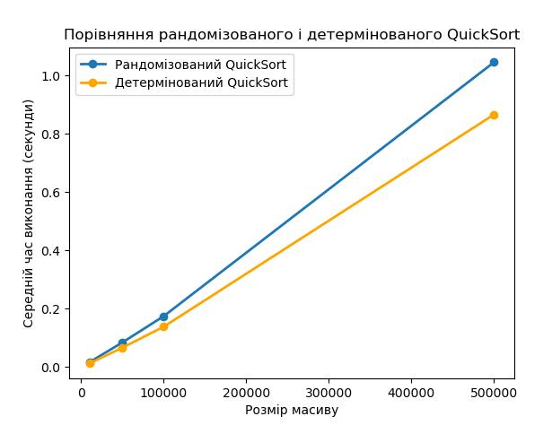

# goit-algo2-hw-10
Домашнє завдання до теми «Алгоритмічна складність, наближені та рандомізовані алгоритми»

## Завдання 1. Порівняння рандомізованого та детермінованого QuickSort
```bash
python3 task-01.py
```

### Результат
```
Розмір масиву: 10000
   Рандомізований QuickSort: 0.0165 секунд
   Детермінований QuickSort: 0.0124 секунд

Розмір масиву: 50000
   Рандомізований QuickSort: 0.0845 секунд
   Детермінований QuickSort: 0.0667 секунд

Розмір масиву: 100000
   Рандомізований QuickSort: 0.1746 секунд
   Детермінований QuickSort: 0.1383 секунд

Розмір масиву: 500000
   Рандомізований QuickSort: 1.0453 секунд
   Детермінований QuickSort: 0.8659 секунд
```



### Висновок
На випадкових даних детермінований алгоритм виходить швидшим, бо у нього відсутні витрати на рендомізацію.
Проте рендомізований варіант має мати перевагу у складних випадках, наприклад, коли вхідний масив вже частково відсортованим

## Завдання 2. Складання розкладу занять за допомогою жадібного алгоритму
```bash
python3 task-02.py
```

### Результат
```
Розклад занять:
Наталія Шевченко, 29 років, email: n.shevchenko@example.com
   Викладає предмети: Біологія, Хімія

Дмитро Бондаренко, 35 років, email: d.bondarenko@example.com
   Викладає предмети: Фізика, Інформатика

Олександр Іваненко, 45 років, email: o.ivanenko@example.com
   Викладає предмети: Математика
```
